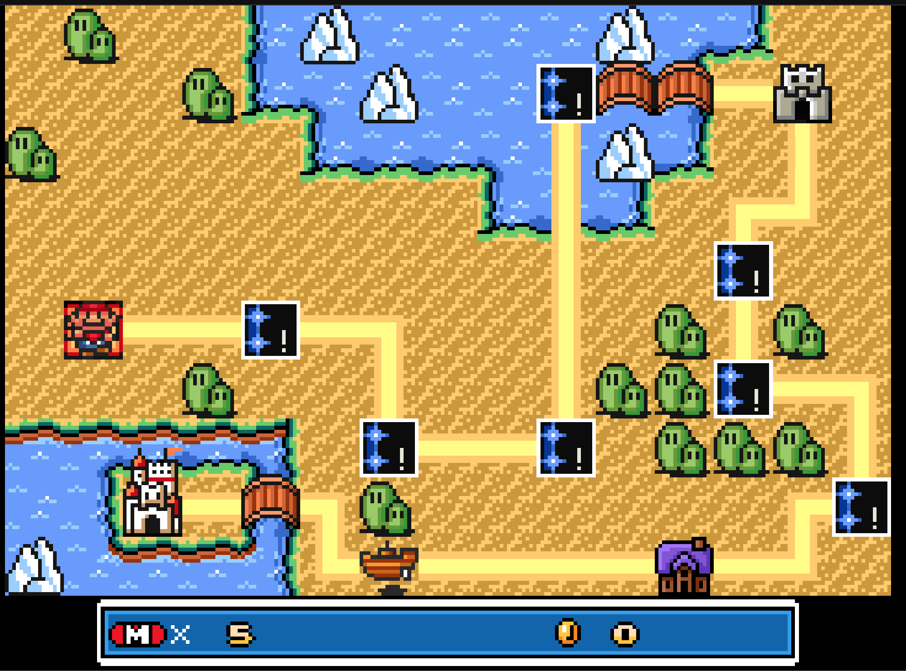
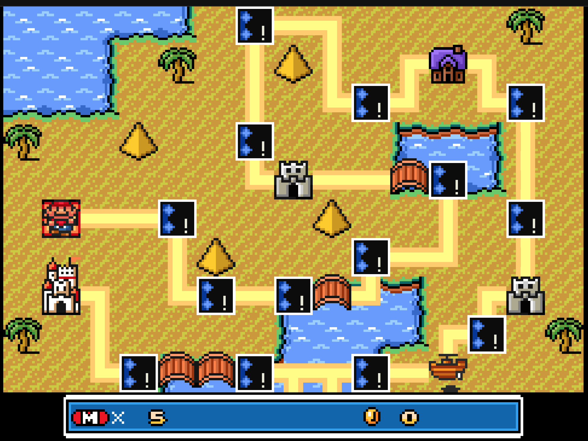
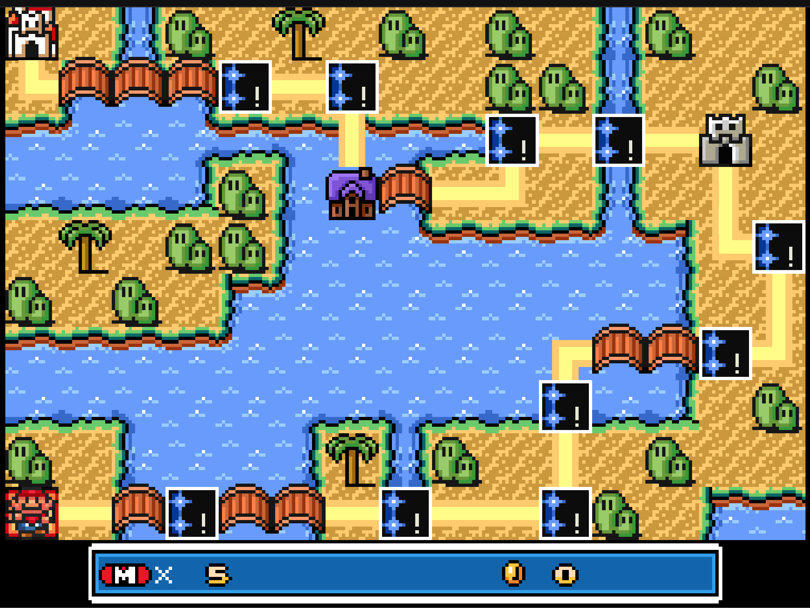
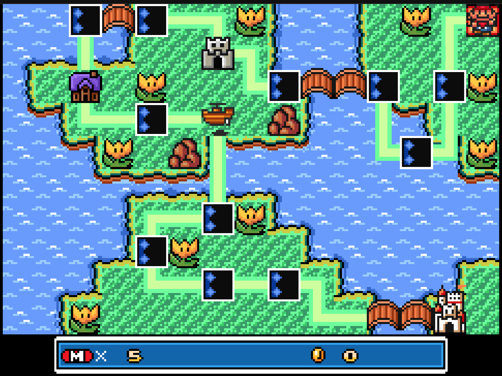

# mario-levels

## Worlds

### World 1

https://github.com/maxbobrikovich/mario-levels/blob/3821c62f3ba199c57cc5730345e988b90734060d/smm-v4/world-1.txt#L1

# World 2

https://github.com/maxbobrikovich/mario-levels/blob/320970f9bc99802b7c1f441eb43d4c13a021ec7b/smm-v4/world-2.txt#L1

# World 3

https://github.com/maxbobrikovich/mario-levels/blob/320970f9bc99802b7c1f441eb43d4c13a021ec7b/smm-v4/world-3.txt#L1

# World 4

https://github.com/maxbobrikovich/mario-levels/blob/e44d298bf80cbea717782c4311c312db18881f77/smm-v4/world-4.txt#L1

# World 5

_in development_

# World 6

_in development_

# World 7

_in development_